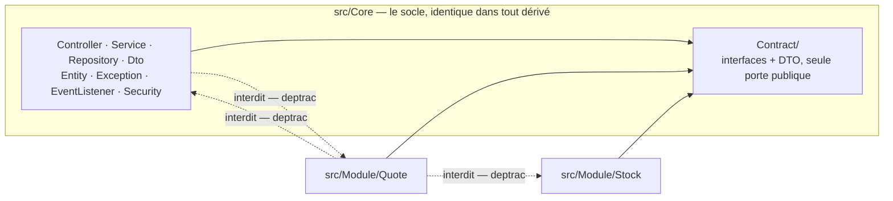
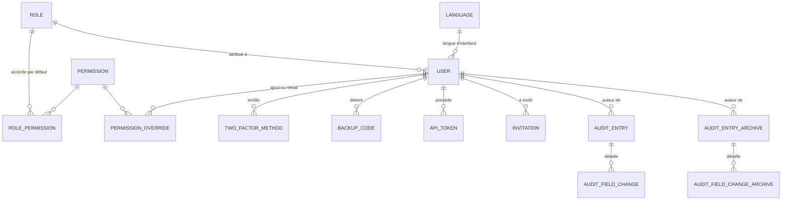
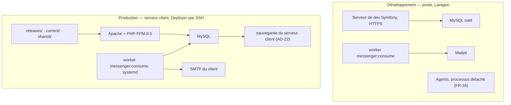

# Architecture Spine — Socle ERP custom (proglab)

Ce document fixe ce que deux morceaux du socle, ou deux dérivés, pourraient trancher
différemment. Il ne redit ni le PRD ni les spines UX, et il ne réécrit pas la suite
`symfony-proglab-*`, qui reste la source des règles de couches. Les titres de section
gardent leur nom canonique anglais ; le contenu est en français. Les raisons vivent
dans `.memlog.md`, pas ici.

## Design Paradigm

**Couches proglab sur deux racines.** Le contrat Contrôleur / Service / Repository /
DTO / Entité de `symfony-proglab-architecture` s'applique intégralement et sans
exception. Le socle y ajoute un seul axe : `src/Core/` porte le socle, chaque
`src/Module/<Nom>/` porte un domaine métier du dérivé, et les deux portent les mêmes
couches, avec les mêmes noms de dossiers.

La frontière entre les deux racines est une dépendance à sens unique et mécanisable.
`src/Core/Contract/` est la seule porte : elle ne contient que des interfaces et des
DTO, sans dépendance Doctrine ni HTTP. Un module ne voit rien d'autre de `Core`.



## Invariants & Rules

### AD-1 — Symfony 7.4 LTS sur PHP 8.5

- **Binds :** tout le socle et tout dérivé.
- **Prevents :** qu'un dérivé livré chez un client tourne sur un socle logiciel hors
  support, et que chaque dérivé impose son propre calendrier de montée de version.
- **Rule :** Symfony 7.4 LTS et PHP 8.5. Aucune dépendance exigeant Symfony 8 n'entre
  dans le socle. Un dérivé ne monte pas de majeure de son propre chef : la montée est
  décidée sur le socle et reportée. PHP 8.5 et non 8.4 parce que le support de sécurité
  de 8.4 s'arrête le 31 décembre 2028, onze mois avant la fin de fenêtre de Symfony 7.4
  LTS, et qu'aucune dépendance de la pile n'interdit 8.5.

### AD-2 — Deux racines, et un dérivé ne touche pas au socle

- **Binds :** tout le code du socle et de tout dérivé.
- **Prevents :** que le socle et le métier du client se mélangent, ce qui rend le report
  d'un correctif illisible dès le troisième module et laisse un agent sans emplacement
  évident pour une entité métier (FR-2).
- **Rule :** `src/Core/` porte le socle et rien d'autre. Tout code propre au client vit
  dans `src/Module/<Nom>/`, avec les mêmes couches et les mêmes noms de dossiers. Un
  dérivé **n'édite aucun fichier de `src/Core/`** : un besoin que `Core` ne couvre pas
  se traite en ajoutant un contrat à `Core/Contract/` sur le socle, puis en reportant.
  Le report d'un correctif est donc un `git diff` sur `src/Core/`, et sur rien d'autre.

### AD-3 — Un seul journal d'audit logique, et ses règles vivent dans un service

- **Binds :** FR-11, FR-12, FR-13, FR-23, et tout module.
- **Prevents :** que le filtre, la page et l'export de FR-13 aient à connaître plus d'une
  source ; et des règles d'audit dispersées dans un listener, hors de toute couche qui
  puisse les tester.
- **Rule :** un unique service d'audit dans `Core/Service/` porte toutes les règles :
  quels objets sont audités, quels champs sont exclus, quel acteur est attribué, quelle
  forme prennent les valeurs. Un listener Doctrine `onFlush` dans
  `Core/EventListener/Doctrine/` ne fait que lire les changesets de l'`UnitOfWork` et
  appeler ce service ; il ne décide rien. Les actions métier (FR-12) appellent le même
  service depuis la couche service. Aucun bundle d'audit n'entre dans le socle, et un
  module n'écrit jamais dans la table. **Le journal est unique en tant que contrat, pas
  en tant que table :** AD-23 lui donne une seconde table d'archive de forme identique, et
  le dépôt d'audit est le seul endroit du système qui sache qu'elle existe. Aucun service
  appelant, aucun contrôleur, aucun template, aucun module ne distingue une entrée en
  ligne d'une entrée archivée.
- **Écart énoncé :** le standard proglab veut des appels directs plutôt que des
  événements. L'audit des modifications est la seule exception, et elle est structurelle :
  FR-11 exige d'auditer *tout* objet métier par défaut, y compris ceux que `Core` ne
  connaîtra jamais, ce qu'aucun appel direct ne peut couvrir. L'exception s'arrête là.
  Les actions métier de FR-12 restent des appels directs.

### AD-4 — Tout email passe par Messenger, avec son contexte complet

- **Binds :** FR-3, FR-4, FR-5, AD-14, AD-21, et tout email d'un module.
- **Prevents :** qu'un SMTP lent ou injoignable fasse échouer une écriture métier déjà
  commitée ; que chaque module invente son propre mode d'envoi ; et qu'un email parte
  dans la mauvaise langue parce que le worker n'a pas la requête qui l'a déclenché.
- **Rule :** les emails sont mis en file sur le transport Doctrine, avec retry et file
  d'échec. **Un message porte tout ce qu'il faut pour être rendu hors requête** :
  destinataire, locale explicite, et des scalaires — jamais une entité, jamais une
  dépendance au contexte de requête. Trois garde-fous accompagnent ce choix et ne sont
  pas optionnels. Le health check de FR-18 passe en état dégradé quand la file cesse
  d'être dépilée ou quand son plus vieux message dépasse un seuil. Le worker est livré
  comme service systemd piloté par Deployer, jamais comme étape manuelle. Le guide de
  dérivation nomme l'enfermement des administrateurs en 2FA par email comme la panne à
  surveiller. Le code 2FA par email porte sa date d'émission, et sa validité de dix
  minutes court depuis l'émission, pas depuis l'envoi.
- **Limite énoncée :** un message porte des scalaires, donc l'adresse et le nom de son
  destinataire, et l'anonymisation d'AD-12 ne les atteint pas. Un envoi déjà en file part
  à l'ancienne adresse — limite acceptée et nommée par le guide de dérivation, pas un
  oubli. Un message parvenu au transport d'échec et portant un compte anonymisé est
  abandonné plutôt que rejoué : au-delà de la file courante, ce ne serait plus « un
  dernier email ».

### AD-5 — L'API n'a pas d'endpoint d'authentification, et son jeton est vérifié à chaque requête

- **Binds :** FR-6, FR-17, FR-18, FR-20, AD-9.
- **Prevents :** de réimplémenter à la main une vérification de second facteur hors de
  `scheb/2fa`, dont le flux en deux étapes est porté par la session et ne se compose pas
  avec un firewall sans état ; et qu'un compte désactivé ou anonymisé garde un jeton
  d'API fonctionnel.
- **Rule :** un jeton d'accès opaque est créé depuis Profil › Jetons d'API, montré une
  seule fois, stocké haché, porteur d'une date d'expiration, révocable par l'utilisateur
  et par un administrateur depuis la fiche utilisateur. Le firewall `/api` est sans état
  et n'accepte que `Authorization: Bearer`. **À chaque requête, l'`AccessTokenHandler`
  vérifie l'expiration et la non-révocation du jeton, et un `UserChecker` refuse un
  compte désactivé ou anonymisé** — `EquatableInterface` (AD-9) n'opère pas sur un
  firewall sans état, donc cette vérification est le seul mécanisme qui tienne ici. Le
  mot de passe ne circule jamais vers l'API.
- **Historique :** FR-17 décrivait l'obtention d'un jeton *par l'API* avec identifiants
  et second facteur. Le PRD a été corrigé le 2026-09-10 ; voir *Écarts amont*.

### AD-6 — Chemins d'URL en anglais et invariables

- **Binds :** toute route du socle et de tout module.
- **Prevents :** qu'un module ajoute des chemins dans une autre langue que le socle, et
  que l'URL dépende de la langue du lecteur dans un produit trilingue et white-label.
- **Rule :** les chemins sont en anglais et ne varient pas avec la locale. Aucun préfixe
  de langue. La langue est portée par le compte et par la session ; le `?lang=` de la
  page de connexion est la seule exception. Résout OQ-UX-4. La correspondance complète
  avec les surfaces d'`EXPERIENCE.md` est fixée ci-dessous ; un module préfixe ses
  chemins par son propre segment.

| Surface | Chemin | Nom de route |
| --- | --- | --- |
| Connexion | `/login` | `app_login` |
| Mot de passe oublié | `/password/forgot` | `app_password_request` |
| Réinitialisation | `/password/reset/{token}` | `app_password_reset` |
| Acceptation d'invitation | `/invitation/{token}` | `app_invitation_accept` |
| Vérification 2FA | `/login/2fa` | `app_2fa_check` |
| Code de secours | `/login/2fa/backup` | `app_2fa_backup` |
| Enrôlement 2FA | `/profile/2fa/enroll` | `app_2fa_enroll` |
| Roadmap (accueil) | `/` | `app_home` |
| Journal d'audit | `/audit-log` | `app_audit_index` |
| Entrée d'audit | `/audit-log/{id}` | `app_audit_show` |
| Export du journal | `/audit-log/export` | `app_audit_export` |
| Utilisateurs | `/users` | `app_user_index` |
| Inviter | `/users/invite` | `app_user_invite` |
| Fiche utilisateur | `/users/{id}` | `app_user_show` |
| Rôles | `/roles` | `app_role_index` |
| Fiche rôle | `/roles/{id}` | `app_role_show` |
| Langues | `/languages` | `app_language_index` |
| Profil | `/profile/{tab}` | `app_profile` |
| Health check | `/api/health` | `app_api_health` |
| Lancer une tâche (dev) | `/roadmap/tasks/{id}/launch` | `app_roadmap_launch` |

### AD-7 — La frontière est imposée par deptrac et par la CI, pas par la revue

- **Binds :** AD-2, AD-13, AD-22, et le contrat de couches proglab.
- **Prevents :** qu'un agent place un service métier dans `src/Core/`, fasse dépendre le
  socle d'un module, ou atteigne les classes internes de `Core` depuis un module, sans
  qu'aucun signal ne le dise.
- **Rule :** `deptrac/deptrac` en `require-dev` vérifie quatre choses, et la CI bloque
  sur chacune : les couches proglab à l'intérieur de chaque racine ; `Core → Module`
  interdit ; `Module → Module` interdit ; et **`Module → Core` interdit partout sauf
  vers `Core\Contract`**. C'est cette dernière règle qui rend le report de correctif
  d'AD-2 mécanisable plutôt que promis.

### AD-8 — La permission effective se calcule à chaque requête

- **Binds :** FR-7 à FR-10, AD-19, AD-20, la navigation d'`EXPERIENCE.md`, tout module.
- **Prevents :** qu'une modification des permissions d'un rôle ne s'applique pas
  immédiatement, ce qu'une matérialisation en session ou une table dénormalisée
  introduirait ; et que deux modules inventent deux façons de tester un droit.
- **Rule :** la permission effective est le rôle, moins les retraits, plus les ajouts de
  surcharge. Elle est calculée à chaque requête, lue par un unique voter, et
  **mémoïsée dans un service dédié à durée de requête** — pas dans le voter, qui reste
  `final readonly`. Aucun code ne teste un nom de rôle ; un besoin qui ressemble à
  « ce rôle est spécial » est un attribut du rôle, pas son nom (voir AD-19).
  `access_control` porte le filet par zone et `#[IsGranted]` la précision par action :
  les deux, comme l'exige le standard, jamais l'un seul. Le catalogue des permissions a
  le code pour source de vérité : chaque module publie ses codes par service taggé, une
  commande de synchronisation projette le catalogue dans la table au déploiement. Un
  code présent en base mais plus déclaré s'affiche comme obsolète et ne s'accorde jamais.
- **Forme des codes :** le code par défaut est `<ressource>.create`, `.read`, `.update`,
  `.delete`. Une action que ces quatre opérations ne décrivent pas garde un code nommé —
  `user.invite`, `user.anonymize`, `audit.export`, `roadmap.launch`, `roadmap.notes` — et
  ces actions **s'accordent dans la même grille**, sous leur ressource : sans case, aucun
  rôle ne pourrait les recevoir.
- **Un registre, pas deux.** Ce qu'un module publie n'est ni une liste de codes ni un
  second vocabulaire : **une déclaration par type, qui porte à la fois son alias de type
  d'AD-12, son nom de ressource, les opérations qu'il supporte, ses actions particulières,
  sa permission de lecture et, facultativement, la route de sa fiche (AD-12)** — un seul contrat de `Core/Contract/` (AD-13). Alias et
  ressource sont **le même identifiant**, sinon le filtre par droits d'AD-12 et la grille
  d'ici parlent de deux choses en croyant parler de la même. Le nom est préfixé par le
  module qui le déclare, et **la commande de synchronisation échoue sur une collision**
  plutôt que de laisser deux modules se partager un `quote.read` — `Module → Module` étant
  interdit (AD-7), rien d'autre ne peut la voir. Un code exigé par `#[IsGranted]` sans
  déclaration correspondante fait échouer la même commande.
- Le catalogue et la grille se dérivent de ce registre. Aucune liste de permissions n'est
  tenue à la main, et une ressource qui ne supporte pas une opération n'en produit pas le
  code. C'est ce qui ferme OQ-5 : un dérivé compose ses rôles depuis cette grille au lieu
  d'hériter d'une liste d'actions décidée en amont.

### AD-9 — Les sessions se ferment par comparaison d'utilisateur

- **Binds :** FR-6, FR-21, AD-5.
- **Prevents :** qu'une désactivation laisse une session ouverte jusqu'à son expiration,
  et qu'un dérivé invente un stockage de sessions en base pour y parvenir.
- **Rule :** le compte porte un jeton de sécurité incrémenté à la désactivation, au
  changement de mot de passe et à la réinitialisation de la 2FA. `EquatableInterface` le
  compare à chaque requête, ce qui déauthentifie toutes les sessions concernées sans
  second magasin. Les sessions restent en fichiers. Le firewall sans état de l'API
  n'est **pas** couvert par ce mécanisme : AD-5 porte son équivalent.
- **Écart énoncé :** `isEqualTo()` sur l'entité `User` est une méthode de comportement
  sur une entité, ce que le standard proscrit. C'est une exigence du contrat de Symfony,
  pas une règle métier : la méthode ne fait que comparer deux champs et ne décide rien.
  Aucune autre méthode de comportement n'entre sur une entité.

### AD-10 — Les fichiers BMAD sont un contrat d'entrée défini et en lecture seule

- **Binds :** FR-14, FR-15, FR-16, AD-20.
- **Prevents :** que plusieurs endroits parsent le même format et divergent quand il
  change ; que la roadmap devienne une seconde vérité ; et que « tâche prête » n'ait pas
  le même sens d'un dérivé à l'autre.
- **Rule :** un unique lecteur dans `Core/Service/` parse ces fichiers de façon
  tolérante et rend des **DTO Output** — seule forme qui franchit la couche service.
  Aucun contrôleur, aucun template, aucun module ne les lit. L'application n'écrit
  jamais dans le dépôt ; seul `var/` est inscriptible. Le contrat d'entrée est celui-ci,
  et le socle le possède plutôt que de le deviner :

  - La source des statuts est `_bmad-output/implementation-artifacts/sprint-status.yaml`.
  - Les clés `epic-{n}` portent une epic, `{n}-{m}-{titre}` une tâche. Les clés
    `epic-{n}-retrospective` **sont exclues du calcul d'avancement** : ce ne sont pas des
    tâches du projet.
  - Priorité, difficulté, assignation et dépendances sont lues dans l'en-tête YAML du
    fichier de story, selon une convention que le socle définit et documente (FR-2).
    Absentes, elles se rendent « non renseigné », et **une tâche sans dépendance
    déclarée est prête** dès que son statut est « à faire ».
  - Un statut inconnu est rendu « à faire » et signalé aux administrateurs. Un fichier
    absent ou mal formé produit une roadmap partielle et un avertissement, jamais une
    erreur.

  Le résultat du parse est **toujours** mis en cache, invalidé par la version de release
  en production et par la date de modification en développement. Ce cache n'est pas une
  optimisation reportable : il est le moyen du budget de performance.

### AD-11 — La surface de lancement d'une tâche n'existe pas en production

- **Binds :** FR-16.
- **Prevents :** qu'un dérivé livré chez un client expose un point d'entrée capable de
  démarrer un processus sur le serveur.
- **Rule :** le service et le contrôleur portent `#[When('dev')]`, **et la route porte
  `#[Route(..., env: 'dev')]`** — le premier attribut ne retire que le service du
  conteneur, pas la route de la table de routage, et FR-16 exige « impossible », pas
  « masqué ». Le lancement démarre un processus local détaché et ne rend compte que du
  démarrage ou de son échec. Un test vérifie qu'en environnement de production la route
  est absente.

### AD-12 — L'audit référence l'acteur, et fige une étiquette pour l'objet

- **Binds :** FR-11, FR-12, FR-13, FR-20, AD-3, AD-8.
- **Prevents :** que l'anonymisation oblige à réécrire des entrées déclarées immuables ;
  qu'un objet supprimé devienne illisible ; que deux morceaux désignent le même type
  d'objet de deux façons, rendant faux le filtre « type d'objet » de FR-13 ; et qu'un
  lecteur voie dans le journal des objets que FR-10 lui interdit ailleurs.
- **Rule :** quatre formes sont fixées.

  1. **L'acteur** est référencé par clé étrangère vers le compte, jamais recopié. Tient
     parce qu'aucune fonction ne supprime un utilisateur (FR-6), et fait qu'« Utilisateur
     anonymisé #12 » apparaît sans toucher une entrée.
  2. **L'objet** est référencé par un **alias de type stable** plus sa clé primaire, plus
     une **étiquette figée à l'écriture**. L'alias est une chaîne courte déclarée par le
     propriétaire du type via `Core/Contract/` — jamais un nom de classe, jamais une
     classe de proxy Doctrine, ce qui survit à un renommage et donne au filtre de FR-13
     un libellé traduisible. L'étiquette figée existe parce qu'un objet supprimé n'a plus
     rien à résoudre à la lecture. Le propriétaire du type peut déclarer **en plus la route
     de la fiche** de ses objets. Le journal rend alors l'objet en lien plutôt qu'en texte,
     mais **seulement** si l'objet existe encore et si le lecteur a le droit de le consulter
     (AD-8) : un lien vers un 403 ou un 404 serait pire que du texte. Sans route déclarée,
     l'objet reste du texte — le socle ne connaît aucun écran métier (AD-2) et n'en devine
     aucun, et n'en déclare aucun pour ses propres objets.
  3. **Les valeurs avant et après** sont normalisées en scalaires ou `null`, avec le type
     déclaré du champ. Jamais un objet sérialisé. Une relation est enregistrée comme
     l'alias, la clé et l'étiquette de l'objet lié. Les champs sensibles sont exclus **à
     l'écriture** par une liste tenue dans `Core` et extensible par module, jamais
     masqués à l'affichage.
  4. **La lecture est filtrée par les droits.** Une entrée n'est rendue à un lecteur que
     s'il a la permission attachée à l'alias de son objet ; le propriétaire du type
     déclare cette permission avec l'alias. Sans cela le journal contournerait les 403 et
     404 de FR-10.

  Une modification faite hors requête HTTP est attribuée à un acteur système nommé. Les
  actions d'authentification (connexion, échec de connexion) sont la seule exception à
  « déclarée depuis la couche service » : elles sont déclarées par la couche sécurité, et
  un échec de connexion n'a **pas** d'acteur référencé — il enregistre l'identifiant
  tenté, qui n'est pas nécessairement un compte.
- **Exception nommée à l'immuabilité :** l'anonymisation (FR-20) réécrit les valeurs et
  les étiquettes qui portent le nom ou l'email du compte — **partout où l'alias plus la
  clé de ce compte apparaissent**, et non dans les seules entrées dont il est l'objet. La
  distinction est décisive : l'étiquette figée du point 3 recopie ce nom dans les entrées
  d'objets *tiers* (« assigné à … »), qui survivraient autrement à l'effacement. La
  réécriture porte sur la table en ligne **et sur l'archive d'AD-23**, dans une seule
  transaction, et rend compte des deux nombres. Elle vit dans le dépôt d'audit, seul
  endroit qui connaisse les deux tables, et reste le seul chemin d'écriture autorisé sur
  une entrée existante. L'opération est elle-même auditée.

### AD-13 — Un module se déclare, le socle ne l'accueille pas

- **Binds :** AD-2, AD-7, AD-8, AD-12, FR-2, FR-7, FR-19.
- **Prevents :** que deux modules étendent le socle par deux mécanismes différents, et
  que le socle doive être modifié pour accueillir un module — ce qui remettrait du code
  client dans `src/Core/` et casserait le report de correctif d'AD-2.
- **Rule :** un module publie ses contributions par des services taggés implémentant des
  contrats de `Core/Contract/` : ses codes de permission, ses alias de type d'objet avec
  leur permission de lecture (AD-12), ses exclusions d'audit, ses entrées de navigation,
  ses catalogues de traduction. **Le câblage framework est fixé une fois pour les deux
  racines, en configuration, par glob sur `src/Module/*/` :** mapping Doctrine des
  entités, chargement des routes par attributs, chemins du translator, découverte des
  services. **Ajouter un module ne modifie donc aucun fichier de `src/Core/` ni aucun
  fichier de `config/`.**

### AD-14 — Les langues actives sont une configuration d'exécution

- **Binds :** FR-19, FR-21, FR-22, AD-4.
- **Prevents :** qu'un dérivé fasse de l'activation d'une langue une variable
  d'environnement, ce que FR-22 interdit en exigeant un écran d'administration et une
  entrée d'audit.
- **Rule :** les langues supportées (`fr`, `en`, `nl`) sont du code ; les langues actives
  sont en base et se modifient depuis l'interface. La langue d'un utilisateur est un
  champ de son compte, résolue côté serveur, portée explicitement dans chaque message
  d'email (AD-4), et appliquée à l'attribut `lang` de la page. Le français est la langue
  source des catalogues. Dates et nombres sont formatés dans la locale du lecteur.

### AD-15 — Invitation et réinitialisation partagent un mécanisme à état

- **Binds :** FR-3, FR-4.
- **Prevents :** qu'un dérivé choisisse une URL signée sans état pour l'un et une entité
  pour l'autre.
- **Rule :** une entité porte destinataire, rôle prévu, jeton aléatoire stocké haché,
  date d'expiration et date d'usage. L'URL transporte le jeton en clair, la base n'en
  garde que l'empreinte. Une URL signée sans état est exclue : elle ne peut ni marquer un
  lien consommé, ni invalider le précédent au renvoi, ni porter les états « en attente »
  et « expirée » que voit l'administrateur.

### AD-16 — Le gabarit de base porte le plancher d'accessibilité

- **Binds :** NFR accessibilité, l'Accessibility Floor d'`EXPERIENCE.md`, tout écran du
  socle et de tout module.
- **Prevents :** que chaque écran réinvente le lien d'évitement, les repères, la gestion
  du focus après navigation et l'annonce des messages — et que l'accessibilité soit
  revendiquée sans être portée nulle part.
- **Rule :** un unique gabarit de base dans `Core` porte le lien « Aller au contenu », les
  repères `<header>`, `<nav aria-label>`, `<main id tabindex="-1">`, `<footer>`, la région
  d'annonces persistante sous Turbo, le `<title>` et l'unique `h1`. Un écran de module
  l'étend et ne le remplace pas. Le plancher WCAG 2.1 de `symfony-proglab-accessibility`
  est vérifié par un test automatisé dans la CI, pas par relecture.

### AD-17 — L'amélioration progressive est une contrainte, pas une intention

- **Binds :** FR-10, les State Patterns et `Responsive & Platform` d'`EXPERIENCE.md`.
- **Prevents :** qu'un écran ne fonctionne qu'avec JavaScript, alors que les spines UX
  promettent le contraire, et qu'un module construise une action destructive sans chemin
  de repli.
- **Rule :** tout chemin fonctionne en pleine page sans JavaScript ; Turbo et Stimulus
  n'ajoutent que le confort. **Chaque action destructive a deux routes : un GET qui rend
  une page de confirmation complète, et un POST porteur d'un jeton CSRF qui agit.** Le
  Dialog du kit est la version confortable du GET, pas un substitut. Les panneaux ont
  tous une URL propre qui rend une page entière. Aucun Live Component dans le socle, non
  par principe d'architecture mais parce qu'`EXPERIENCE.md` a constaté qu'aucun écran n'a
  d'état serveur à retenir entre deux interactions ; un module qui en aurait vraiment un
  suit `symfony-proglab-frontend`.

### AD-18 — Les frontières d'écriture sont protégées de façon uniforme

- **Binds :** NFR sécurité, FR-3, FR-5, FR-10, tout formulaire du socle et de tout module.
- **Prevents :** que chaque formulaire décide seul de sa protection, et que le
  ralentissement exigé par FR-3 soit réécrit à la main dans chaque chemin
  d'authentification.
- **Rule :** CSRF obligatoire sur toute écriture, sans exception. Le ralentissement des
  échecs de connexion utilise le `login_throttling` natif du SecurityBundle, adossé à
  `symfony/rate-limiter` ; la vérification du second facteur, la demande de
  réinitialisation et l'acceptation d'invitation portent chacune leur propre limiteur
  nommé. L'affichage rend les **secondes** restantes, que l'exception native ne fournit
  pas : le délai restant est lu sur le limiteur, pas déduit du message. Aucun blocage
  définitif.

### AD-19 — L'obligation de 2FA est un attribut du rôle

- **Binds :** FR-5, AD-8, le délai de grâce d'`EXPERIENCE.md`.
- **Prevents :** que « la 2FA est obligatoire pour Super admin et Admin » se code par un
  test de nom de rôle, qu'AD-8 interdit, et qu'un dérivé ayant renommé ses rôles perde
  l'obligation.
- **Rule :** le rôle porte un booléen « exige la double authentification ». Le compte
  porte la date de début de son délai de grâce, posée à la première connexion sous un
  rôle qui l'exige et remise à zéro si le rôle change. Un unique point d'application —
  un listener de requête dans `Core`, `scheb/2fa` n'en fournissant aucun — affiche le
  bandeau pendant le délai puis redirige vers l'enrôlement, en laissant toujours
  accessibles le profil et la déconnexion. **Le délai vaut sept jours**, porté par un
  paramètre `app.` et non par une constante, pour qu'un dérivé plus exposé le raccourcisse
  sans toucher au code. **Aucun rôle n'en est exempt** : un booléen qui exige la 2FA
  ouvre le délai, y compris pour le rôle qui porte toutes les permissions. Une exemption
  serait un second test de rôle déguisé, qu'AD-8 interdit.

### AD-20 — Le journal d'audit a un budget, et les moyens qui vont avec

- **Binds :** NFR performance, FR-13, FR-23, AD-10, AD-12, AD-23.
- **Prevents :** que le journal tienne le budget p95 sous la seconde sur un jeu de test
  et l'explose chez le premier client à un million d'entrées.
- **Portée :** ce budget couvre la **fenêtre en ligne** d'AD-23. Une requête qui déborde
  sur l'archive en sort, et l'écran l'annonce ; les index ci-dessous existent malgré tout
  sur les deux tables, pour que ce dépassement reste borné.
- **Rule :** trois moyens, nommés parce qu'ils sont la seule raison pour laquelle le
  budget est tenable. La table porte des index déclarés pour les cinq axes de filtre de
  FR-13 : horodatage, acteur, alias de type d'objet, couple alias plus clé, type
  d'entrée. Les étiquettes et libellés d'une page sont résolus **par lot pour la page
  entière**, jamais ligne par ligne. L'export porte sur la sélection filtrée et est
  **streamé** par lots, hors Turbo, sans charger la sélection en mémoire ; il passe par la
  **même lecture filtrée par les droits** que l'écran (AD-12 point 4) — `audit.export`
  autorise à emporter ce que le lecteur voit déjà, jamais à voir plus. Un test
  d'intégration compte les requêtes d'une page de journal, **sur une sélection qui
  traverse les deux tables d'AD-23**, et échoue si le nombre croît avec le nombre de
  lignes.

### AD-21 — Un cas d'usage, une transaction, et les effets après le commit

- **Binds :** AD-3, AD-4, AD-12, tout service du socle et de tout module.
- **Prevents :** qu'une entrée d'audit soit perdue parce que personne n'a flushé, qu'une
  écriture d'audit provoque un second flush imprévu, et qu'un message Messenger soit
  consommé avant que la donnée qu'il décrit soit visible.
- **Rule :** le service porte la frontière de transaction et appelle `flush()` une fois
  par cas d'usage, comme l'exige le standard. L'entrée d'audit produite par le listener
  d'AD-3 est écrite **dans la même transaction**, par l'`UnitOfWork` en cours, sans
  second `flush()` — un rollback emporte donc l'audit avec la donnée, et c'est voulu.
  Les messages sont dispatchés de façon à n'être consommables **qu'après le commit**, le
  middleware de dispatch différé de Messenger étant le mécanisme. Une action métier
  déclarée avant un rollback disparaît avec lui ; aucune entrée d'audit ne décrit donc un
  état qui n'a pas existé.

### AD-22 — La CI et la reprise font partie du socle livré

- **Binds :** NFR qualité, NFR observabilité, AD-7, AD-16, AD-20, FR-2.
- **Prevents :** qu'AD-7 et AD-16 promettent un blocage en CI qu'aucun dérivé ne fait
  tourner, et qu'un dérivé arrive chez un client sans que personne sache comment le
  restaurer.
- **Rule :** le socle livre sa configuration de CI, et elle bloque sur la même liste que
  la tâche de qualité locale : analyse statique, style, deptrac, tests, accessibilité,
  `composer audit`. La base de données de CI est celle de la production, jamais SQLite.
  La sauvegarde de la base et des fichiers est une **responsabilité du serveur client,
  nommée et documentée** par le guide de dérivation, avec la procédure de restauration
  et l'exigence qu'elle ait été exécutée une fois avant la mise en service. Le socle ne
  fournit pas l'outil de sauvegarde ; il refuse seulement que la question reste muette.

### AD-23 — L'archive est une seconde table que seul le dépôt d'audit connaît

- **Binds :** FR-13, FR-20, FR-23, AD-3, AD-12, AD-20, AD-21, NFR performance.
- **Prevents :** que la rétention se règle par une suppression, ce que FR-23 interdit ;
  que la connaissance des deux tables remonte au-dessus du dépôt, ce qui obligerait chaque
  appelant à choisir sa source ; qu'une entrée en cours de déplacement soit vue deux fois,
  ou pas du tout, par une page ou un export ; et qu'un dérivé invente sa propre politique
  de rétention.
- **Rule :** cinq points, et aucun n'est décoratif.

  1. **Forme et identité.** La table d'archive porte exactement la même forme que la table
     en ligne — mêmes colonnes, même normalisation des valeurs, mêmes index qu'AD-20
     déclare — et **l'entrée y garde sa clé primaire**. Une clé n'est jamais réattribuée.
     C'est ce qui fait que `/audit-log/{id}` désigne une entrée et une seule, et que le
     couple `(horodatage, id)` est un **ordre total** sur les deux tables réunies. Les
     lignes de détail d'une entrée voyagent avec elle et gardent la leur.
  2. **Où passe la frontière.** Nulle part dans un `if`. Chaque lecture résout **un point
     de coupure une fois par requête**, interroge les deux tables avec le même prédicat de
     filtre, et les réunit **en SQL** — union, tri sur `(horodatage, id)`, `LIMIT`/`OFFSET`
     et comptage sur l'union, jamais une fusion en PHP. Une entrée déplacée pendant la
     requête peut apparaître des deux côtés : la déduplication sur la clé primaire la
     ramène à une occurrence. C'est ce qui rend l'offset de la convention *Listes* tenable
     ici sans pagination par curseur.
  3. **Le déplacement.** Les règles vivent dans un service ; la commande console n'est
     qu'une couche de traduction, comme l'exige le standard. Le service travaille par lots
     de taille fixée en paramètre `app.`, et **chaque lot est une seule transaction**
     portant l'insertion et la suppression — deux transactions laisseraient des doublons
     permanents au premier incident. Il écrit en SQL depuis le dépôt et **non par l'ORM** :
     l'ORM ferait auditer l'audit par le listener d'AD-3, puis auditer sa propre
     suppression. Les deux tables d'audit sont exclues de l'audit par construction. Le
     critère est « plus vieux que la fenêtre », donc relancer la commande ne déplace que ce
     qui reste. Le Scheduler la déclenche, dans son propre schedule et sur son propre
     worker de superviseur — jamais mêlée à la file `async` d'AD-4, dont les pics
     retarderaient le timer. Une crontab appelant `bin/console` reste un repli légitime sur
     un dérivé sans superviseur.
  4. **Ce que l'écran annonce.** Le budget d'AD-20 ne couvre que la fenêtre en ligne, et
     une requête qui remonte plus loin peut en sortir. L'écran l'annonce — mais il annonce
     **la période demandée**, qu'il lit dans le filtre, jamais la table atteinte. Le
     contrôleur ne distingue donc toujours pas les deux sources, et le contrat d'AD-3
     tient. Les index d'AD-20 existent sur les deux tables pour que ce dépassement reste
     borné.
  5. **Ce qui surveille.** Le health check de FR-18 passe en état dégradé quand la plus
     vieille entrée en ligne dépasse la fenêtre d'une marge : sans cela, un worker mort
     laisse la rétention silencieusement inappliquée, exactement la faiblesse qu'AD-4
     surveille déjà sur la file d'emails.
- **Écart énoncé :** AD-3 disait « un seul journal d'audit » ; il dit désormais « un seul
  journal *logique* ». Ce qu'il interdisait — que le filtre, la page et l'export
  connaissent deux sources — reste interdit, et c'est le dépôt qui l'absorbe. Le
  partitionnement RANGE de MySQL aurait gardé une table unique, mais il impose une clé
  primaire composite contraire à l'identifiant entier auto-incrémenté du standard, et il
  parie sur la version et la configuration MySQL du serveur client qu'AD-1 laisse
  indéterminées.

## Consistency Conventions

| Concern | Convention |
| --- | --- |
| Espaces de noms | `App\Core\<Couche>\…` et `App\Module\<Nom>\<Couche>\…`. Le nom d'un module est un singulier anglais en PascalCase. Seul `App\Core\Contract\…` est visible d'un module. |
| Dossiers de couche | Mêmes noms dans les deux racines : `Controller/`, `Service/`, `Repository/`, `Dto/{Input,Read,Output}/`, `Entity/`, `Exception/`, `EventListener/`, `Security/`, `Command/`, `Twig/`. Pas de dossier par thème métier à la place d'une couche. |
| Services | `final readonly`, injection par constructeur, nommés d'après leur unique responsabilité (`UserInviter`, `AuditReader`), jamais `<Chose>Service`. Repositories non `final`. |
| Entités | Format maker, identifiants entiers auto-incrémentés, `\DateTimeImmutable`, enums natifs avec `enumType:`. Aucune règle, aucun invariant, aucune méthode de comportement — l'`isEqualTo()` d'AD-9 est la seule exception, et elle est énoncée. |
| DTO | `Dto/Input/` porte la validation, `Dto/Read/` les projections `SELECT NEW`, `Dto/Output/` le contrat qui franchit la couche service. Le mapping passe par `ObjectMapperInterface` (`symfony/object-mapper`, stable depuis Symfony 7.4). |
| Routes | Nom `app_<ressource>_<action>`, préfixe de chemin au niveau de la classe, chemins anglais (AD-6), une classe de contrôleur par ressource. |
| Erreurs | Exceptions métier dans `Exception/` avec `#[WithHttpStatus]` et `#[WithLogLevel]`. API : Problem Details RFC 7807. Zone non permise : 403. Objet non permis : 404, identique à un objet inexistant. |
| Listes | Enveloppe `items` + `meta` avec page, perPage, total, pages. Pas de pagination par curseur, pas de Pagerfanta. Une liste bâtie sur plusieurs tables (AD-23) réunit, trie, compte et pagine **en SQL** sur un ordre total, jamais en PHP. |
| Permissions | Code stable en `snake_case` préfixé par sa ressource, forme CRUD par défaut (`user.create`, `audit.read`). Hors CRUD, code nommé (`user.invite`, `audit.export`, `roadmap.notes`). Un module déclare ses ressources et leurs opérations, jamais une liste de codes. `access_control` par zone et `#[IsGranted]` par action, jamais l'un seul. |
| Audit | Tout objet métier audité par défaut ; exclusion explicite déclarée par le propriétaire du type. Alias de type stable — **le même identifiant que le nom de ressource d'AD-8** —, étiquette figée, valeurs scalaires normalisées (AD-12). Action métier : code stable, libellé traduisible, déclarée depuis la couche service. Deux tables de forme identique, en ligne et archive, à clé primaire partagée, connues du seul dépôt d'audit (AD-23). |
| Traduction | Catalogues par domaine, source française, clés en anglais pointées. Un module livre ses catalogues par AD-13. |
| Configuration | Variable d'environnement quand cela dépend de la machine, paramètre `app.` pour un comportement identique partout, constante de classe pour ce qui ne bouge presque jamais. Secrets : `.env.local` en développement, **coffre de secrets Symfony en production parce que la cible est un serveur nu déployé par SSH et qu'il n'existe aucun magasin de plateforme** ; `SYMFONY_DECRYPTION_SECRET` devient alors le seul secret vivant hors du dépôt. |
| Frontend | AssetMapper, Twig, Stimulus, Turbo. Aucun bundler, aucune étape Node. Aucune règle métier en JavaScript. Tout chemin fonctionne sans JavaScript (AD-17). |
| Tests | Test écrit d'abord et vu rouge. `dama/doctrine-test-bundle`. Chaque FR couverte par au moins un test fonctionnel. Base de CI identique à la production (AD-22). |

## Stack

Versions vérifiées sur `symfony.com/releases.json`, Packagist et les dépôts amont les
2026-09-09 et 2026-09-10.

| Name | Version |
| --- | --- |
| PHP | 8.5 |
| Symfony | 7.4 LTS |
| Doctrine ORM / DBAL | 3.7 / 4.4 |
| MySQL | version du serveur client |
| scheb/2fa-bundle (totp, email, backup-code) | 8.6 |
| symfony/messenger — transport Doctrine | 7.4 |
| symfony/scheduler + dragonmantank/cron-expression — déclenche l'archivage (AD-23) | 7.4 |
| symfony/lock — verrou de la commande d'archivage (AD-23) | 7.4 |
| symfony/rate-limiter | 7.4 |
| symfony/object-mapper | 7.4 |
| symfony/asset-mapper | 7.4 |
| symfony/ux-turbo, stimulus-bundle, ux-twig-component | 3.4 |
| symfony/ux-toolkit — kit shadcn | 3.4 (expérimental) |
| symfonycasts/tailwind-bundle — Tailwind 4 | 1.0 |
| deptrac/deptrac | 4.7 |
| dama/doctrine-test-bundle, phpstan, php-cs-fixer/shim | require-dev |

Deux réserves portées par cette pile. `symfony/ux-toolkit` est officiellement
expérimental et ses composants sont copiés dans le dépôt sans garantie de
rétrocompatibilité : le kit shadcn est un design system que le socle maintient
lui-même, pas une dépendance qui se met à jour. Et `damienharper/auditor-bundle`
n'apparaît pas ici : sa branche 7.x exige Symfony 8, ce qu'AD-1 exclut, et AD-3 écrit
l'audit à la main.

## Structural Seed

```text
src/
  Core/
    Contract/        # seule porte publique : interfaces + DTO, sans Doctrine ni HTTP
    Controller/
    Service/         # règles du socle, dont l'audit (AD-3) et la roadmap (AD-10)
    Repository/
    Dto/{Input,Read,Output}/
    Entity/
    Exception/
    Security/        # voter unique, authenticator, UserChecker, AccessTokenHandler
    EventListener/
      Doctrine/      # listener onFlush, couche de traduction seule (AD-3)
    Command/         # initialisation (FR-1), synchronisation du catalogue (AD-8)
    Twig/
  Module/
    <Nom>/           # mêmes couches, mêmes noms de dossiers, code du client
config/              # câblage des deux racines par glob (AD-13)
migrations/
templates/
translations/        # fr (source), en, nl
tests/
public/  bin/  var/  # var/ est le seul répertoire inscriptible (AD-10)
_bmad-output/        # embarqué dans la release, lu seulement (AD-10)
```

Entités du socle. Le journal d'audit désigne son objet par alias de type et clé primaire,
sans clé étrangère, ce qui lui permet de viser une entité de module que le socle ne
connaît pas (AD-12). Les deux tables d'archive ont la forme exacte de leurs jumelles en
ligne et n'existent que pour le dépôt d'audit (AD-23).



Environnements et déploiement. Aucun conteneur, aucun service externe payant.



Les migrations s'exécutent à chaque release, le worker est redémarré par Deployer, et la
date de la release est la « date du dernier déploiement » qu'affiche FR-14.

## Capability → Architecture Map

| Capability / Area | Lives in | Governed by |
| --- | --- | --- |
| FR-1 Initialisation | `Core/Command/` | AD-8, AD-22, enveloppe de déploiement |
| FR-2 Guide de dérivation | racine du dépôt | AD-2, AD-10, AD-13, AD-22 |
| FR-3, FR-4 Invitation et mot de passe | `Core/Service/`, `Core/Entity/` | AD-15, AD-4, AD-18 |
| FR-5 Double authentification | `Core/Security/` | AD-19, AD-9, AD-4, AD-18 |
| FR-6, FR-20, FR-21 Cycle de vie du compte | `Core/Service/` | AD-9, AD-5, AD-12 |
| FR-7 à FR-10 Rôles et permissions | `Core/Security/`, `Core/Entity/` | AD-8, AD-13, AD-19 |
| FR-11, FR-12 Écriture de l'audit | `Core/Service/`, `Core/EventListener/Doctrine/` | AD-3, AD-12, AD-21 |
| FR-13 Lecture de l'audit | `Core/Service/`, `Core/Repository/` | AD-12, AD-20, AD-23 |
| FR-23 Archivage de l'audit | `Core/Service/`, `Core/Repository/`, `Core/Command/` | AD-23, AD-3, AD-12, AD-21 |
| FR-14, FR-15 Roadmap | `Core/Service/` | AD-10, AD-20 |
| FR-16 Lancer une tâche | `Core/Service/`, `Core/Controller/` | AD-11 |
| FR-17 Jetons d'API | `Core/Security/`, Profil | AD-5 |
| FR-18 Health check | `Core/Controller/` | AD-4 |
| FR-19, FR-22 Langues | `Core/Service/`, `translations/` | AD-14, AD-13 |
| Tout écran | `templates/` | AD-16, AD-17, AD-6 |
| Domaine métier d'un dérivé | `src/Module/<Nom>/` | AD-2, AD-7, AD-13, AD-21 |

## Écarts amont, corrigés le 2026-09-10

Ce spine a contredit ses sources en cinq endroits. **Les cinq corrections ont été
appliquées en amont** le 2026-09-10 : les documents et ce spine disent désormais la même
chose. La table reste pour la trace.

| Source | Ce qu'elle disait | Correction appliquée |
| --- | --- | --- |
| PRD FR-17 | Le jeton d'API s'obtient par l'API avec identifiants et second facteur. | Réécrit d'après AD-5 : création depuis le Profil, aucun endpoint d'authentification, jeton montré une fois, vérifié à chaque requête, aucun mot de passe vers l'API. |
| PRD §6 et §7 | Un dérivé n'est pas mis à jour ; les correctifs se reportent à la main. | Réécrit d'après AD-1 : le code du socle n'est pas resynchronisé, mais un dérivé livré est maintenu et ses montées de version sont décidées sur le socle. |
| PRD §10, OQ-3 | Les champs BMAD restaient à trancher par Fabrice après les premiers fichiers. | Close d'après AD-10 : le socle définit la convention d'en-tête qu'il attend. La roadmap n'a plus de dépendance bloquante. |
| Addendum du PRD | La version de Symfony, le mécanisme de signature de l'invitation et le bundle d'audit étaient ouverts. | Tranchés d'après AD-1, AD-15 et AD-3, avec les alternatives écartées et leur raison. |
| Addendum du brief | Gedmo Loggable est à écarter parce qu'il reste lié à DBAL 3. | Corrigé : sa version 3.22.1 supporte DBAL 4. Il reste écarté pour une autre raison, car il est opt-in par entité et stocke un tableau sérialisé. |

## Deferred

Ce que ce spine refuse de trancher, et ce qui rouvrirait la question.

- **Noyau partagé sous forme de bundle plutôt que clonage.** Le PRD §6 assume le
  clonage. À rouvrir quand les dérivés se compteront en dizaines.
- **Multi-tenant et compte valable sur plusieurs dérivés.** Hors périmètre (PRD §7).
- **Purge du journal d'audit.** AD-23 archive et ne supprime rien ; quand et si une
  suppression devient nécessaire, ce sera une décision de conservation légale, pas de
  performance.
- **Outil de sauvegarde fourni par le socle.** AD-22 nomme la responsabilité et la
  procédure ; l'outiller viendra quand deux dérivés auront le même hébergeur.
- **Exécuteur d'agents côté serveur.** Quand le nombre de dérivés l'amortira.
- **Transport Messenger autre que Doctrine.** Sous charge mesurée seulement.
- **Cache HTTP et cache applicatif au-delà d'AD-10 et d'AD-20.** Sur lenteur mesurée.
- **Les routes de fiche que déclareront les modules d'un dérivé.** AD-12 fixe la forme —
  une route facultative par type, un lien seulement si l'objet existe et si le lecteur
  peut le consulter — et refuse d'en nommer une seule, le socle ne connaissant aucun écran
  métier. Le premier module qui en déclare une n'a rien à rouvrir ici.
